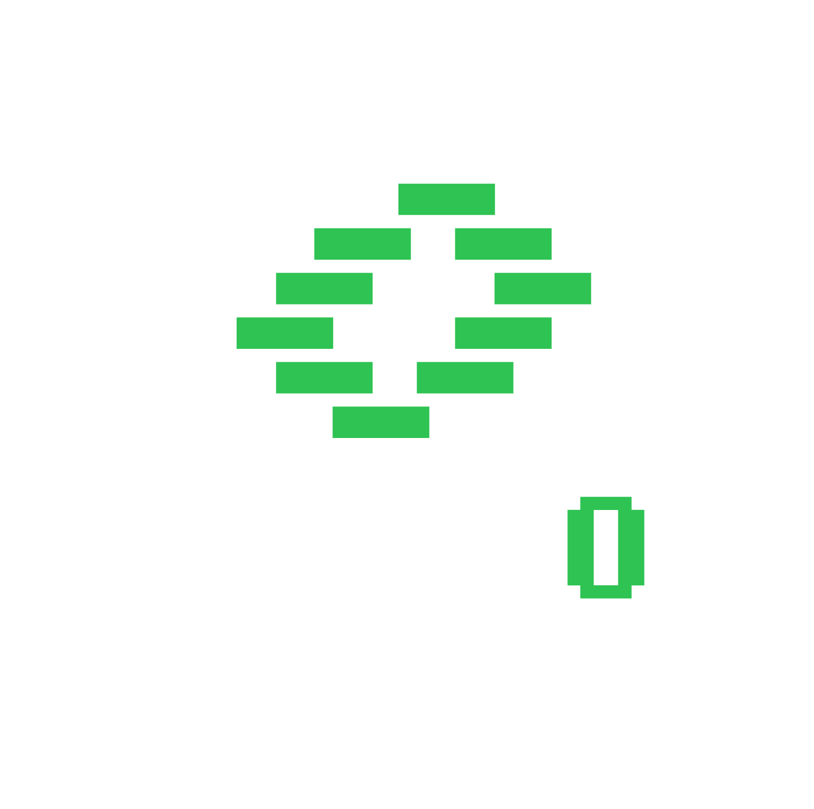

# CLI 代理 API

[English](README.md) | 中文 | [日本語](README_JA.md)

一个为 CLI 提供 OpenAI/Gemini/Claude/Codex/Grok 兼容 API 接口的代理服务器。

您可以通过任何与 OpenAI（包括 Responses）、Gemini（包括 Interactions）或 Claude 兼容的客户端或 SDK，以本地方式或多 CLI 账户访问以下提供商。

<table>
<tbody>
    <tr>
        <th align="center" width="100">提供商</th>
        <th align="center">说明</th>
    </tr>
    <tr>
        <td align="center"></td>
        <td>Kimi 系列模型（Kimi K2.7 Code、Kimi K2.6 等）。<a href="https://platform.kimi.com/docs/guide/kimi-k2-7-code-quickstart">Kimi K2.7 Code</a> 是一款面向编码与复杂软件工程任务的开源智能体模型，在真实世界的长周期任务中实现了更高的端到端成功率。与 K2.6 相比，其思考 Token 用量约减少 30%。CLIProxyAPI 支持通过 OAuth 或兼容 API 接入 Kimi。立即体验 <a href="https://www.kimi.com/code/?aff=cliproxyapi">Kimi Code 订阅</a>，或前往 <a href="https://platform.kimi.com/?aff=cliproxyapi">Kimi 开放平台</a> 获取 API Key。感谢 Kimi 对开源社区的贡献！</td>
    </tr>
    <tr>
        <td align="center"></td>
        <td>OpenAI GPT 系列模型（GPT 5.6、GPT 5.5 等）。GPT-5.6 为复杂生产工作流树立了新的质量与效率基线。GPT-5.6 尤其节省 token，并提升了前端审美表现，包括布局、视觉层级与设计判断力。</td>
    </tr>
    <tr>
        <td align="center"></td>
        <td>Anthropic Claude 系列模型（Claude Fable、Claude Opus、Claude Sonnet 等）。Claude Fable 5 是 Anthropic 公开发布中能力最强的模型，专为最严苛的推理与长周期智能体任务打造。</td>
    </tr>
    <tr>
        <td align="center"></td>
        <td>Google Gemini 系列模型（Gemini 3.5 Flash、Gemini 3.1 Pro 等）。Gemini 3.5 Flash 提供面向真实世界任务优化的持续前沿级智能，速度更快、成本更低。面向智能体时代设计，擅长子智能体部署、多步骤工作流以及大规模长周期任务。该模型尤其适合包含复杂编码循环与迭代的快速智能体回路。</td>
    </tr>
    <tr>
        <td align="center"></td>
        <td>xAI Grok 系列模型（Grok 4.5、Grok Composer 2.5 Fast 等）。Grok 4.5 是 SpaceXAI 面向编程、智能体任务与知识工作打造的前沿模型。它在 SpaceXAI 位于孟菲斯的数据中心训练，并使用了覆盖科学、工程与数学的新数据集。</td>
    </tr>
</tbody>
</table>

## 赞助商

感谢 PackyCode 对本项目的赞助！

PackyCode 是一家可靠高效的 API 中转服务商，提供 Claude Code、Codex、Gemini 等多种服务的中转。

PackyCode 为本软件用户提供了特别优惠：使用<a href="https://www.packyapi.com/register?aff=cliproxyapi" target="_blank">此链接</a>注册，并在充值时输入 "cliproxyapi" 优惠码即可享受九折优惠。

---

<table>
<tbody>
<tr>
<td width="180"></td>
<td>感谢 AICodeMirror 赞助了本项目！AICodeMirror 提供 Claude Code / Codex / Gemini 官方高稳定中转服务，支持企业级高并发、极速开票、7×24 专属技术支持。 Claude Code / Codex / Gemini 官方渠道低至 3.8 / 0.2 / 0.9 折，充值更有折上折！AICodeMirror 为 CLIProxyAPI 的用户提供了特别福利，通过<a href="https://www.aicodemirror.com/register?invitecode=TJNAIF" target="_blank">此链接</a>注册的用户，可享受首充8折，企业客户最高可享 7.5 折！</td>
</tr>
<tr>
<td width="180"></td>
<td>感谢 BmoPlus 赞助了本项目！BmoPlus 是一家专为AI订阅重度用户打造的可靠 AI 账号代充服务商，提供稳定的 ChatGPT Plus / ChatGPT Pro(全程质保) / Claude Pro / Super Grok / Gemini Pro 的官方代充&成品账号。 通过<a href="https://shop.bmoplus.com/?utm_source=github" target="_blank">BmoPlus AI成品号专卖/代充</a>注册下单的用户，可享GPT <b>官网订阅一折</b> 的震撼价格！</td>
</tr>
<tr>
<td width="180"></td>
<td>感谢 VisionCoder 对本项目的支持。<a href="https://visioncoder.cn/">VisionCoder 开发平台</a> 是一个可靠高效的 API 中继服务提供商，提供 Claude Code、Codex、Gemini 等主流 AI 模型，帮助开发者和团队更轻松地集成 AI 功能，提升工作效率。此外，VisionCoder 还提供 <b>Claude Max 200 与 GPT Pro 200 高级成品号</b>的独家售卖渠道，助力体验全网顶配 AI 的算力与体验。</td>
</tr>
<tr>
<td width="180"></td>
<td>感谢 APIKEY.FUN 赞助本项目！APIKEY.FUN 是一家专业的企业级 AI 中转站，致力于为企业和个人开发者提供稳定、高效、低成本的 AI 模型 API 接入服务。平台支持 Claude、OpenAI、Gemini 等主流热门模型，价格低至官方原价的 7%。通过本项目<a href="https://apikey.fun/register?aff=CLIProxyAPI">专属链接</a>注册，还可享受最高 <b>充值永久 95 折</b> 专属优惠。</td>
</tr>
<tr>
<td width="180"></td>
<td>RunAPI 是高效稳定的API OpenRouter平替平台，一个 API Key 即可访问 OpenAI、Claude、Gemini、DeepSeek、Grok 等 150+ 主流模型，低至 1 折，极其稳定，可以无缝兼容 Claude Code、OpenClaw 等工具。RunAPI 为 CPA的用户提供专属福利：<a href="https://runapi.co/register?aff=FivD">注册</a>联系管理员即可领取￥7的免费额度</td>
</tr>
<tr>
<td width="180"></td>
<td>Cat API 是一家面向个人开发者与团队的 AI 大模型聚合平台，致力于将主流大模型能力整合到一个简单、稳定、易用的入口中。平台提供完全兼容 OpenAI、Claude、Gemini 的 API，可无缝接入 Claude Code、Cursor、Windsurf、Cline、Roo Code、Continue、Codex、Trae 等主流 AI IDE 与编程工具，并主打 CN2 高速线路，为用户带来低延迟、高稳定的访问体验。<a href="https://catapi.ai/sign-up">注册</a>即可领取 1$ 的免费额度。</td>
</tr>
<tr>
<td width="180"></td>
<td>赛博支付（CyberPay）成立于2021年。我们致力于为AI从业者商家提供稳定、高效、安全的支付结算解决方案。与我们合作即可使您的网站平台解决用户支付宝/微信收款问题。承接售卖GPT 、Gemini、Claude、Codex账号与中转站等各类业务合作，解决各位商家收款困难痛点。<a href="https://t.me/CyberWlD/218">联系我们</a>开启您的致富通道。</td>
</tr>
<tr>
<td width="180"></td>
<td>感谢 <a href="https://console.claudeapi.com/agent/register/pJq9T52Fpugrhpgo">Claude API</a> 赞助本项目！Claude API 是专注 Claude 模型的官方渠道 API 服务商，基于 Anthropic 官方 Key 与 AWS Bedrock 官方渠道，提供稳定的 Claude Code 与 Agent 应用接入体验，支持 Claude 全系列模型，保留 Tool Use、长上下文等官方能力。服务非逆向、非降智，适合 Claude Code 深度用户、Agent 工程师与企业技术团队使用。通过<a href="https://console.claudeapi.com/agent/register/pJq9T52Fpugrhpgo">专属链接</a>注册后联系客服，可领取免费测试额度，并支持开票和团队对接。</td>
</tr>
<tr>
<td width="180"></td>
<td>感谢 <a href="https://code0.ai/agent/register/slxVMR3uVBoRgNBf">Code0</a> 赞助本项目！code0.ai 是面向开发者与技术团队的 AI 编程工作台，聚合 Claude Code、Codex 等主流 Agent 编程能力，支持代码生成、项目理解、调试修复、代码审查与文档生成等常见研发场景。适合独立开发者、Agent 工程师、开源项目维护者和企业研发团队使用，支持开票和团队对接。通过<a href="https://code0.ai/agent/register/slxVMR3uVBoRgNBf">专属链接</a>注册后联系客服，可领取免费测试额度，体验更高效的 AI 编程工作流。</td>
</tr>
<tr>
<td width="180"></td>
<td>感谢 <a href="https://api.fenno.ai/register?redirect=/purchase?tab=subscription%26group=16&amp;aff=DQFAMNB6CBLY">Fenno.ai</a> 赞助本项目！Fenno.ai 是一家稳定、高效的API 中转服务商，目前主要提供 Codex 中转服务，兼容OpenAI 及 Anthropic 协议，可灵活接入 Codex、Claude Code、OpenCode等主流编程工具，可稳定支撑千亿Token/日的企业级调用需求，支持国内及海外主体公对公结算、开票。Fenno.ai 为 CLIProxyAPI 的用户提供了专属福利：通过<a href="https://api.fenno.ai/register?redirect=/purchase?tab=subscription%26group=16&amp;aff=DQFAMNB6CBLY">此链接</a>即可订阅<b>9.9 元/150刀额度</b>的超值Coding Plan，邀请好友最高可享20%奖励，多邀多得！</td>
</tr>
<tr>
<td width="180"></td>
<td>感谢 <a href="https://s.qiniu.com/7zUJri">七牛云AI</a> 赞助本项目！七牛云AI 是七牛云(02567.HK)旗下企业级大模型MaaS平台，一站式调用全球 150+ 主流模型，兼容全球主流模型厂商协议，覆盖文本、图像、音频、视频、文件处理等全模态处理能力，服务超过 169 万企业及开发者用户。专属福利：企业用户免费领 <b>1200万 Token</b>，邀请好友最高得百亿 Token。</td>
</tr>
<tr>
<td width="180"></td>
<td>感谢 Cubence 对本项目的赞助！Cubence 是一家可靠高效的 API 中转服务商，提供 Claude Code、Codex、Gemini 等多种服务的中转。Cubence 为本软件用户提供了特别优惠：使用<a href="https://cubence.com/signup?code=CLIPROXYAPI&source=cpa">此链接</a>注册，并在充值时输入 "CLIPROXYAPI" 优惠码即可享受九折优惠。</td>
</tr>
<tr>
<td width="180"></td>
<td>感谢 <a href="https://www.fastaitoken.com/">FastAIToken</a> 对本项目的赞助！ FastAIToken 是面向开发者的 AI API 聚合平台，追求极速、稳定。支持 OpenAI、Claude、Gemini 等主流大模型，充值 1:1，1 元 = 1 美元 API 额度，让开发者以更低成本、更便捷地使用全球领先的大模型服务，QQ服务群1054566214。 平台提供多种渠道自由选择：超级低价的0.02x OpenAI 福利分组（限时）、低至 0.25x OpenAI 分组、0.7x Claude 95%固定缓存、1.2x Claude Max 渠道；同时提供公开状态页，实时展示各分组的可用率、延迟及运行状态，服务透明可靠，并提供 7×24 小时真人技术支持（非机器人），快速响应开发者需求。针对企业用户可以构建SLA专线号池，包稳定，可签合同开票专人维护。</td>
</tr>
</tbody>
</table>

## 功能特性

- 为 CLI 模型提供 OpenAI/Gemini/Claude/Codex/Grok 兼容的 API 端点
- 新增 OpenAI Codex（GPT 系列）支持（OAuth 登录）
- 新增 Claude Code 支持（OAuth 登录）
- 新增 Grok Build 支持（OAuth 登录）
- 支持流式、非流式响应，以及受支持场景下的 WebSocket 响应
- 函数调用/工具支持
- 多模态输入（文本、图片）
- 多账户支持与轮询负载均衡（Gemini、OpenAI、Claude、Grok）
- 简单的 CLI 身份验证流程（Gemini、OpenAI、Claude、Grok）
- 支持 Gemini AIStudio API 密钥
- 支持 AI Studio Build 多账户轮询
- 支持 Claude Code 多账户轮询
- 支持 OpenAI Codex 多账户轮询
- 支持 Grok Build 多账户轮询
- 通过配置接入上游 OpenAI 兼容提供商（例如 OpenRouter）
- 可复用的 Go SDK（见 `docs/sdk-usage_CN.md`）

## 新手入门

CLIProxyAPI 用户手册： [https://help.router-for.me/](https://help.router-for.me/cn/)

## 管理 API 文档

请参见 [MANAGEMENT_API_CN.md](https://help.router-for.me/cn/management/api)

## 使用量统计

自v6.10.0版本以后，CLIProxyAPI及 [CPAMC](https://github.com/router-for-me/Cli-Proxy-API-Management-Center) 项目不再预置数据统计功能，如果有数据统计需求的请使用以下项目：

### [CPA Usage Keeper](https://github.com/Willxup/cpa-usage-keeper)

独立的 CLIProxyAPI 使用量持久化与可视化服务，定期同步 CLIProxyAPI 数据，存储到 SQLite，提供聚合 API，并内置使用量分析与统计仪表盘。

### [CPA-Manager-Plus](https://github.com/seakee/CPA-Manager-Plus)

面向 CLIProxyAPI 的完整管理中心，提供请求级监控和费用预估。CPA-Manager 可按账号、模型、渠道、延迟、状态和 token 用量追踪采集到的请求；支持可编辑模型价格与一键同步 LiteLLM 价格来估算费用；用 SQLite 持久化事件；并提供面向 Codex 账号池的批量巡检、配额识别、异常账号定位、清理建议与一键执行能力，适合多账号池的日常运维管理。

## SDK 文档

- 使用文档：[docs/sdk-usage_CN.md](docs/sdk-usage_CN.md)
- 高级（执行器与翻译器）：[docs/sdk-advanced_CN.md](docs/sdk-advanced_CN.md)
- 认证: [docs/sdk-access_CN.md](docs/sdk-access_CN.md)
- 凭据加载/更新: [docs/sdk-watcher_CN.md](docs/sdk-watcher_CN.md)
- 自定义 Provider 示例：`examples/custom-provider`

## 贡献

欢迎贡献！请随时提交 Pull Request。

1. Fork 仓库
2. 创建您的功能分支（`git checkout -b feature/amazing-feature`）
3. 提交您的更改（`git commit -m 'Add some amazing feature'`）
4. 推送到分支（`git push origin feature/amazing-feature`）
5. 打开 Pull Request

## 谁与我们在一起？

这些项目基于 CLIProxyAPI:

### [vibeproxy](https://github.com/automazeio/vibeproxy)

一个原生 macOS 菜单栏应用，让您可以使用 Claude Code & ChatGPT 订阅服务和 AI 编程工具，无需 API 密钥。

### [Subtitle Translator](https://github.com/VjayC/SRT-Subtitle-Translator-Validator)

一款跨平台的桌面和 Web 应用程序，可通过 CLIProxyAPI 使用您现有的 LLM 订阅（Gemini、ChatGPT、Claude, etc.）来翻译和验证 SRT 字幕 - 无需 API 密钥。

### [CCS (Claude Code Switch)](https://github.com/kaitranntt/ccs)

CLI 封装器，用于通过 CLIProxyAPI OAuth 即时切换多个 Claude 账户和替代模型（Gemini, Codex, Antigravity），无需 API 密钥。

### [Quotio](https://github.com/nguyenphutrong/quotio)

原生 macOS 菜单栏应用，统一管理 Claude、Gemini、OpenAI 和 Antigravity 订阅，提供实时配额追踪和智能自动故障转移，支持 Claude Code、OpenCode 和 Droid 等 AI 编程工具，无需 API 密钥。

### [ProxyPilot](https://github.com/Finesssee/ProxyPilot)

原生 Windows CLIProxyAPI 分支，集成 TUI、系统托盘及多服务商 OAuth 认证，专为 AI 编程工具打造，无需 API 密钥。

### [Claude Proxy VSCode](https://github.com/uzhao/claude-proxy-vscode)

一款 VSCode 扩展，提供了在 VSCode 中快速切换 Claude Code 模型的功能，内置 CLIProxyAPI 作为其后端，支持后台自动启动和关闭。

### [ZeroLimit](https://github.com/0xtbug/zero-limit)

Windows 桌面应用，基于 Tauri + React 构建，用于通过 CLIProxyAPI 监控 AI 编程助手配额。支持跨 Gemini、Claude、OpenAI Codex 和 Antigravity 账户的使用量追踪，提供实时仪表盘、系统托盘集成和一键代理控制，无需 API 密钥。

### [CPA-XXX Panel](https://github.com/ferretgeek/CPA-X)

面向 CLIProxyAPI 的 Web 管理面板，提供健康检查、资源监控、日志查看、自动更新、请求统计与定价展示，支持一键安装与 systemd 服务。

### [CLIProxyAPI Tray](https://github.com/kitephp/CLIProxyAPI_Tray)

Windows 托盘应用，基于 PowerShell 脚本实现，不依赖任何第三方库。主要功能包括：自动创建快捷方式、静默运行、密码管理、通道切换（Main / Plus）以及自动下载与更新。

### [霖君](https://github.com/wangdabaoqq/LinJun)

霖君是一款用于管理AI编程助手的跨平台桌面应用，支持macOS、Windows、Linux系统。统一管理Claude Code、Gemini、OpenAI Codex等AI编程工具，本地代理实现多账户配额跟踪和一键配置。

### [CLIProxyAPI Dashboard](https://github.com/itsmylife44/cliproxyapi-dashboard)

一个面向 CLIProxyAPI 的现代化 Web 管理仪表盘，基于 Next.js、React 和 PostgreSQL 构建。支持实时日志流、结构化配置编辑、API Key 管理、Claude/Gemini/Codex 的 OAuth 提供方集成、使用量分析、容器管理，并可通过配套插件与 OpenCode 同步配置，无需手动编辑 YAML。

### [All API Hub](https://github.com/qixing-jk/all-api-hub)

用于一站式管理 New API 兼容中转站账号的浏览器扩展，提供余额与用量看板、自动签到、密钥一键导出到常用应用、网页内 API 可用性测试，以及渠道与模型同步和重定向。支持通过 CLIProxyAPI Management API 一键导入 Provider 与同步配置。

### [Shadow AI](https://github.com/HEUDavid/shadow-ai)

Shadow AI 是一款专为受限环境设计的 AI 辅助工具。提供无窗口、无痕迹的隐蔽运行方式，并通过局域网实现跨设备的 AI 问答交互与控制。本质上是一个「屏幕/音频采集 + AI 推理 + 低摩擦投送」的自动化协作层，帮助用户在受控设备/受限环境下沉浸式跨应用地使用 AI 助手。

### [ProxyPal](https://github.com/buddingnewinsights/proxypal)

跨平台桌面应用（macOS、Windows、Linux），以原生 GUI 封装 CLIProxyAPI。支持连接 Claude、ChatGPT、Gemini、GitHub Copilot 及自定义 OpenAI 兼容端点，具备使用分析、请求监控和热门编程工具自动配置功能，无需 API 密钥。

### [CLIProxyAPI Quota Inspector](https://github.com/AllenReder/CLIProxyAPI-Quota-Inspector)

上手即用的面向 CLIProxyAPI 跨平台配额查询工具，支持按账号展示 codex 5h/7d 配额窗口、按计划排序、状态着色及多账号汇总分析。

### [CLIProxy Pool Watch](https://github.com/murasame612/CLIProxyPoolWidget)

原生 macOS SwiftUI 应用，用于监控 CLIProxyAPI 池中的 ChatGPT/Codex 账号额度。通过 Management API 展示账号可用状态、Plus 基准容量、5 小时与周额度进度条、套餐权重和恢复预测。

### [Panopticon](https://github.com/eltmon/panopticon-cli)

面向 AI 编程助手的多智能体编排工具。它将 CLIProxyAPI 作为本地 sidecar 运行，使其智能体可以通过 ChatGPT 订阅驱动 GPT 模型，并将 Claude Code 指向 Anthropic 兼容端点，无需 OpenAI API 密钥。

### [Tunnel Agent](https://github.com/Villoh/tunnel-agent)

Windows 桌面 UI，通过单一界面管理 CLIProxyAPI 和 Perplexity WebUI Scraper，灵感来自 Quotio 和 VibeProxy。连接 OAuth 提供商（Claude、Gemini、Codex、Kimi、Antigravity）、自定义 API 密钥和 Perplexity 会话账号，然后将任意编程智能体指向本地端点。

### [Quotio Desktop](https://github.com/xiaocoss/quotio-desktop)

Quotio 的跨平台（Tauri）移植版，支持 Windows / macOS / Linux。通过 CLIProxyAPI 管理多账号代理池（Codex、Claude Code、GitHub Copilot、Gemini、Antigravity、Kiro、Cursor、Trae、GLM），提供每账号 5 小时 / 每周额度进度条、Codex 主动重置次数与一键重置、智能调度、用量统计及 Codex 多开实例，无需 API 密钥。

### [Universal Chat Provider](https://github.com/maxdewald/vscode-universal-chat-provider)

VS Code 扩展，可将你的 Claude、ChatGPT/Codex、Antigravity、Grok 和 Kimi 订阅作为原生语言模型接入 GitHub Copilot Chat，并且也可用于生成 Git 提交信息、聊天标题和摘要。它以完全托管的后台生命周期运行 CLIProxyAPI（下载、验证、监督），并在所有窗口间共享，因此无需配置。无需 API 密钥，只需 OAuth。

### [CPA-Tray-Powershell](https://github.com/IQ-Director/CPA-Tray-Powershell)

基于 PowerShell 的 Windows CLIProxyAPI 托盘启动工具。支持无终端窗口后台运行、打开管理页面、关闭管理窗口后保持后端运行，并可通过托盘重新打开页面；同时支持启动时自动检查 CLIProxyAPI 更新、SHA-256 校验与失败回滚、一键重启并更新 CLIProxyAPI、基于 PID 校验的进程管理以及安全停止服务。

### [Grok Search MCP](https://github.com/MapleMapleCat/Grok_Search_Mcp)

一个仅支持 HTTP 传输的模型上下文协议（MCP）服务器，使用 CLIProxyAPI 部署为 MCP 客户端提供由 Grok 驱动的实时网页搜索、X/Twitter 搜索和模型发现功能。它还提供 MCP 传输、客户端 API 密钥管理、配额、用量跟踪和 Web 管理面板。

> [!NOTE]  
> 如果你开发了基于 CLIProxyAPI 的项目，请提交一个 PR（拉取请求）将其添加到此列表中。

## 更多选择

以下项目是 CLIProxyAPI 的移植版或受其启发：

### [9Router](https://github.com/decolua/9router)

基于 Next.js 的实现，灵感来自 CLIProxyAPI，易于安装使用；自研格式转换（OpenAI/Claude/Gemini/Ollama）、组合系统与自动回退、多账户管理（指数退避）、Next.js Web 控制台，并支持 Cursor、Claude Code、Cline、RooCode 等 CLI 工具，无需 API 密钥。

### [OmniRoute](https://github.com/diegosouzapw/OmniRoute)

代码不止，创新不停。智能路由至免费及低成本 AI 模型，并支持自动故障转移。

OmniRoute 是一个面向多供应商大语言模型的 AI 网关：它提供兼容 OpenAI 的端点，具备智能路由、负载均衡、重试及回退机制。通过添加策略、速率限制、缓存和可观测性，确保推理过程既可靠又具备成本意识。

### [Playful Proxy API Panel (PPAP)](https://github.com/daishuge/playful-proxy-api-panel)

一个公开的 CLIProxyAPI 兼容二开版本和配套管理面板，尽量保持与上游一致的使用方式，同时恢复内置使用量统计，并补充缓存命中率、首字响应时间、TPS 记录和面向 Docker 自托管的安装说明。

### [Codex Switch](https://github.com/9ycrooked/CodexSwitch)

这是一个使用 Tauri 2 + Vue 3 构建的工具，用于管理多个 OpenAI Codex 桌面账户。它可以在已保存的 ChatGPT/Codex 认证配置之间切换，实时查看 5 小时和每周配额使用情况，验证 token 健康状态，查看当前账户详情，并在无需手动复制的情况下导入或保存 auth.json 文件。

> [!NOTE]  
> 如果你开发了 CLIProxyAPI 的移植或衍生项目，请提交 PR 将其添加到此列表中。

## 许可证

此项目根据 MIT 许可证授权 - 有关详细信息，请参阅 [LICENSE](LICENSE) 文件。

## 写给所有中国网友的

QQ 群：188637136（满）、1081218164

或

Telegram 群：https://t.me/CLIProxyAPI
